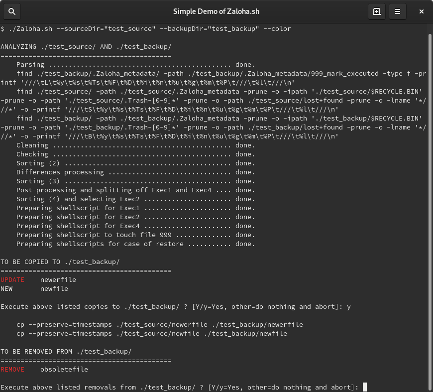

# Zaloha.sh

Zaloha is a small and simple directory synchronizer:

 * Zaloha is a BASH script that uses only FIND, SORT and AWK.
 * All you need is the Zaloha.sh file (contains ~76 kB of program code and ~78 kB of documentation).
 * No compilation, installation and configuration is required.
 * Cyber-secure: No new binary code, no new open ports, easily reviewable.
 * Both directories must be available locally (local HDD/SSD, flash drive, mounted Samba or NFS volume).
 * Zaloha does not lock files while copying them. No writing on either directory may occur while Zaloha runs.
 * Zaloha always copies whole files via the operating system's CP command (= no delta-transfer like in RSYNC).
 * Zaloha is not memory-constrained (metadata is processed as CSV files, no limit for huge directory trees).
 * Zaloha has optional reverse-synchronization features.
 * Zaloha can optionally compare files byte by byte.
 * Zaloha prepares scripts for case of eventual restore.

Full documentation is available both [online](DOCUMENTATION.md) as well as inside of Zaloha.sh.

On Linux/Unics, Zaloha runs natively. On Windows, Cygwin is needed.

## What are synchronization programs good for ?

[Read article here](https://fitus.github.io/).

## How does Zaloha.sh work ?

### Explained in five sentences

 * FIND is executed to scan both directories to obtain CSV metadata about files and subdirectories.
 * The CSV metadata is compared by a sequence of sorts and AWK processing steps.
 * The results (= prepared synchronization actions) are presented to the user for confirmation.
 * If the user confirms, the synchronization actions are executed.
 * A non-interactive regime is available as well.

### Explained by an Interactive Flowchart

[Open Interactive JavaScript Flowchart here](https://fitus.github.io/flowchart.html).

### Explained in full detail

Read the relevant sections in the [Documentation](DOCUMENTATION.md).

## Obtain Zaloha.sh

The simplest way: Under the green button "<b>Code</b>" above, choose "<b>Download ZIP</b>".
From the downloaded ZIP archive, extract Zaloha.sh and make it executable (<b>chmod u+x Zaloha.sh</b>).

For running the Simple Demo, extract also the scripts Simple_Demo_step1/2/3/4/5/6/7.sh and make them executable.

## Usage Example

```bash
Zaloha.sh --sourceDir="test_source" --backupDir="test_backup" [other options, see docu]
```

## Usage Screenshot


## Performance data

Performance was measured on following system and data:

 * Standard commodity PC with Intel i3, 3.3GHz, 4GB RAM
 * Source directory: local Seagate HDD 500GB, 7200rpm, SATA III
 * Backup directory: a second local Seagate HDD 500GB, 7200rpm, SATA III
 * Filesystem: ext4 on both HDDs
 * Data synchronized: 110 GB, 88.000 files
 * Operating system: Linux (Fedora 30)
 * Binary utilities used by Zaloha: GNU find, GNU sort, mawk
 * Zaloha options: --noRestore YES, --mawk YES, --hLinks NO, --byteByByte NO

Measured performance of the analysis phase:
 * first run: 25 seconds (filesystem data not cached in the OS: the FIND scans are slow)
 * second run: 5 seconds (filesystem data cached in the OS: the FIND scans are fast)

Performance of the execution phase:
 * depends on how many files need synchronization: zero to several minutes

## Development status

 * From the perspective of my own requirements and ideas, Zaloha is a completed work.
 * Zaloha successfully passes all my test cases.
 * Eventual (conclusive) Problem Reports are welcome (via Issues).
 * Enhancement Requests so far they won't contradict the "small and simple synchronizer" idea (= no program code inflation, no new processing steps, no increase in runtime etc).

## Add-on script Zaloha_Snapshot.sh

An add-on script to create hardlink-based snapshots of the backup directory exists: [Zaloha_Snapshot](https://github.com/Fitus/Zaloha_Snapshot.sh).
This allows to create **Time&nbsp;Machine**-like backup solutions.

## License
MIT License
